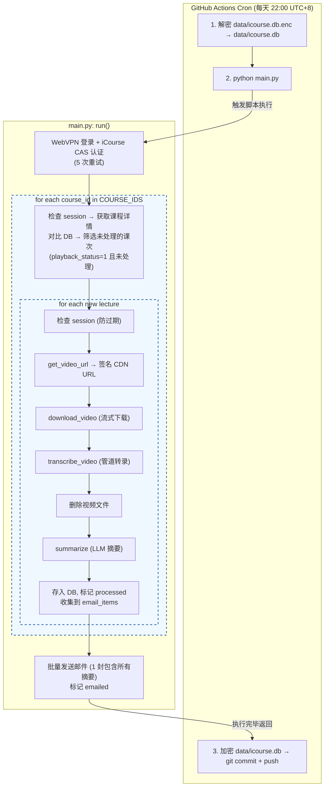

# iCourse Subscriber

自动监控复旦大学 iCourse 智慧教学平台的课程更新，对新课次的录播视频进行**语音转文字 + AI 摘要**，并通过邮件推送到你的邮箱。

部署在 GitHub Actions 上，每天定时运行，**零成本、免服务器、全自动**。

## 它能做什么？

假设你选了「摸鱼学导论」和「躺平学原理」两门课。在每天设定的时间，iCourse Subscriber 会自动：

1. 登录你的复旦 iCourse 账号（通过 WebVPN）
2. 检查这两门课是否有新的录播视频
3. 如果有：下载视频 → 语音识别 → AI 生成课程笔记
4. 将所有新课次的笔记汇总成**一封邮件**发送给你

邮件包含专业排版的 Markdown 渲染内容，覆盖课程重点、讲解内容、例子讲解等。如果老师提到了作业、考试、签到、组队等重要课程事项，会在笔记开头醒目标注。

> [!CAUTION]
> **⚠️ 合规使用声明**
> 
> 本项目的设计初衷仅为辅助本校学生进行**个人的日常学习与复习**与进行技术交流。程序采用“流式处理、阅后即焚”的架构，默认不保存任何视频文件。任何人在部署和使用本项目时，必须严格遵守《复旦大学智慧教学资源平台使用规范》及相关校纪校规。**严禁使用者利用本程序进行以下违规操作，一切因滥用导致的账号封禁或纪律处分（如通报批评、限制平台权限等），均由使用者自行承担，与本仓库及作者无关：**
> 
> * **严禁二次分发与传播**：《规范》第二部分明确指出，平台教学资源属于职务作品，未经许可不得传播。**禁止**将推送到你邮箱的课程摘要、转录文本或笔记转发给他人，或发布到任何公共网络平台。
> * **严禁修改代码非法下载视频**：《规范》严禁未经许可对平台资源进行复制和下载。基于此，本项目并不留存视频，**严禁**任何人修改源代码将受版权保护的课程录播违规下载、保存到任何本地或云端存储介质。
> * **严禁解密或泄露数据库**：仓库中的 `icourse.db.enc` 仅用于程序追踪课次进度避免重复计算。**严禁**手动解密该数据库以提取、滥用或公开其中的转录和摘要文本信息。
> * **注意账号环境安全**：本程序会使用你的 UIS 凭证进行云端 WebVPN 自动化登录，有触发异地登录风控的可能。请妥善保管个人 Secret，因使用云端自动化服务导致的账号异常风险由使用者自行评估。
> 
> **当你 Fork 并配置 Secret 运行本项目时，即代表你已知晓上述风险，并承诺仅在授权范围内为个人学习目的使用本工具，遵守相关校纪校规。**

## 快速部署（5 分钟）

### 第 1 步：Fork 本仓库

点击页面右上角的 **Fork** 按钮，将仓库复制到你的 GitHub 账号下。

### 第 2 步：配置 Secrets

进入你 Fork 后的仓库，点击 **Settings → Secrets and variables → Actions → New repository secret**，逐个添加以下 7 个 Secret：

| Secret 名称 | 说明 | 示例 |
|---|---|---|
| `STUID` | 复旦学号 | `22307110000` |
| `UISPSW` | UIS 统一身份认证密码 | `your_password` |
| `COURSE_IDS` | 要监控的课程 ID，多个用英文逗号分隔 | `35472,30251` |
| `DASHSCOPE_API_KEY` | ModelScope 平台 API Key | `ms-xxxxxxxx` |
| `SMTP_EMAIL` | 用于发送邮件的 QQ 邮箱 | `123456@qq.com` |
| `SMTP_PASSWORD` | QQ 邮箱 SMTP **授权码**（不是登录密码） | `abcdefghijklmnop` |
| `RECEIVER_EMAIL` | 接收摘要邮件的邮箱（可以和发件邮箱相同） | `you@m.fudan.edu.com` |

不知道这些secrets是什么意思？见如下讲解：

### 第 3 步：获取课程 ID

登录 [iCourse 网页版](https://icourse.fudan.edu.cn)，进入你要监控的课程页面，URL 中的数字就是课程 ID：


多门课用英文逗号隔开：`35472,30251,40123`

### 第 4 步：获取 ModelScope API Key

1. 注册 [ModelScope](https://modelscope.cn/)
2. 进入 [API 密钥管理](https://modelscope.cn/my/myaccesstoken) 页面
3. 创建一个 API Key，复制到 `DASHSCOPE_API_KEY`
4. 根据平台指引绑定阿里云账号，否则后续调用可能失败

> 魔搭社区提供每天两千次的免费API调用额度，无需付费即可调用大模型api生成课程笔记。

### 第 5 步：获取 QQ 邮箱 SMTP 授权码

1. 登录 [QQ 邮箱](https://mail.qq.com) → 设置 → 账户与安全 → 安全设置
2. 找到「POP3/IMAP/SMTP/Exchange/CardDAV/CalDAV 服务」
3. 开启 SMTP 服务，按提示获取**授权码**（16 位字母）
4. 将授权码填入 `SMTP_PASSWORD`

> SMTP授权码的作用是以你邮箱的名义给你自己发送邮件通知。

### 第 6 步：运行

- **自动运行**：默认为每天下午13:00、晚上20:00（北京时间）自动执行，如需修改可在 `check.yml` 中修改 cron
- **手动触发**：进入仓库 → Actions → iCourse Check → Run workflow

首次运行会处理所有已有录播，后续只处理新增课次。

## 本地运行（Linux环境）

> 本地运行方式未经测试，建议使用github actions方式部署。

```bash
# 克隆仓库
git clone https://github.com/你的用户名/Fudan_iCourse_Subscriber.git
cd Fudan_iCourse_Subscriber

# 安装依赖
pip install -r requirements.txt
sudo apt install ffmpeg   # Ubuntu/Debian
# brew install ffmpeg     # macOS

# 下载 ASR 模型（约 200MB，首次需要）
wget https://github.com/k2-fsa/sherpa-onnx/releases/download/asr-models/sherpa-onnx-sense-voice-zh-en-ja-ko-yue-2024-07-17.tar.bz2
tar xf sherpa-onnx-sense-voice-zh-en-ja-ko-yue-2024-07-17.tar.bz2
rm sherpa-onnx-sense-voice-zh-en-ja-ko-yue-2024-07-17.tar.bz2
wget https://github.com/k2-fsa/sherpa-onnx/releases/download/asr-models/silero_vad.onnx

# 配置环境变量（复制 .env.example 并编辑）
cp .env.example .env
# 编辑 .env 填入你的信息，然后:
export $(cat .env | xargs)

# 运行
python main.py
```

## 数据安全与知识产权

- **不保留视频**：视频下载后立即通过 ffmpeg 管道转录，转录完成立即删除
- **数据库加密存储**：SQLite 数据库在提交到仓库前使用 AES-256-CBC 加密，密钥由你的多个 Secret 拼接派生，即使仓库公开，他人也无法解密
- **隐私日志**：所有控制台输出已审计，不会打印 token、密码、URL 等敏感信息到 Actions 日志
- **Fork 安全**：他人 Fork 你的仓库后，因 Secret 不同会解密失败，程序会自动从空数据库开始，不会报错

---

## 技术实现

以下内容面向对实现细节感兴趣的开发者。

### 项目结构

```
├── main.py                 # 主流程编排：登录 → 检测 → 处理 → 邮件
├── src/
│   ├── config.py           # 环境变量与常量配置
│   ├── webvpn.py           # WebVPN AES 加密 + 7 步 IDP 认证
│   ├── icourse.py          # iCourse API 客户端 + CDN 视频签名
│   ├── transcriber.py      # ffmpeg 管道 + silero VAD + SenseVoice ASR
│   ├── summarizer.py       # ModelScope LLM 摘要生成
│   ├── emailer.py          # 批量邮件：Markdown → HTML 渲染 + CSS 排版
│   └── database.py         # SQLite 课次追踪与状态管理
├── .github/workflows/
│   └── check.yml           # GitHub Actions 定时任务 + 加密数据库持久化
├── requirements.txt
└── .env.example
```

### 整体流程



### WebVPN 认证（`src/webvpn.py`）

我们逆向了复旦的WebVPN和UIS登录的完整流程，以便在线定时登录。以下是流程说明：

复旦 WebVPN 使用 **AES-128-CFB** 对目标 URL 的主机名进行加密，IV 固定为 `wrdvpnisthebest!`。例如：

```
原始 URL:  https://icourse.fudan.edu.cn/courseapi/v3/...
WebVPN URL: https://webvpn.fudan.edu.cn/https/[32字节IV hex][密文hex]/courseapi/v3/...
```

IDP 登录是一个 7 步流程：

| 步骤 | 操作 | 关键数据 |
|------|------|---------|
| 1 | GET `/idp/authCenter/authenticate` | 提取 `lck` 参数（跟随重定向链） |
| 2 | POST `/idp/authn/queryAuthMethods` | 获取 `authChainCode`（userAndPwd 模块） |
| 3 | GET `/idp/authn/getJsPublicKey` | 获取 RSA 公钥（Base64） |
| 4 | 本地加密 | RSA PKCS1_v1.5 加密密码 |
| 5 | POST `/idp/authn/authExecute` | 提交加密密码，获取 `loginToken` |
| 6 | POST `/idp/authCenter/authnEngine` | 用 loginToken 换取 CAS ticket URL |
| 7 | GET ticket URL | 跟随重定向建立 session（设置 cookie） |

iCourse CAS 认证复用相同的 7 步流程，但所有请求都通过 WebVPN 代理发送。程序在每次处理课次前检查 session 存活性，过期则自动重新执行完整登录。

### CDN 视频签名（`src/icourse.py`）

iCourse 的视频 CDN 需要签名参数才能下载。签名算法通过逆向前端 JS 获得：

```python
# 签名参数 t 的生成
pathname  = urlparse(video_url).path
timestamp = server_now   # 来自 get-sub-info API 的 now 字段
hash_input = f"{pathname}{user_id}{tenant_id}{reversed_phone}{timestamp}"
md5_hash  = md5(hash_input)
t = f"{user_id}-{timestamp}-{md5_hash}"

# 最终 URL
signed_url = f"{video_url}?clientUUID={uuid4()}&t={t}"
```

其中 `reversed_phone` 是用户手机号字符串的反转（如 `"13812345678"` → `"87654321831"`）。这些用户信息通过 `/userapi/v1/infosimple` API 获取并缓存。

视频 URL 的提取有三级回退：`video_list[*].preview_url` → `playurl[*]` → `get-sub-detail` fallback。

### 语音转文字管道（`src/transcriber.py`）

采用流式管道架构，避免将整个视频加载到内存：

```
Video File
    │
    ▼
 ffmpeg (子进程)
    │  -ar 16000 -ac 1 -f f32le  (16kHz 单声道 PCM float32)
    │
    ▼ stdout pipe (每次读 1 秒 = 64KB)
    │
 silero VAD
    │  512 样本窗口 (32ms), 最小静音 0.25s
    │  检测语音边界，输出语音片段
    │
    ▼
 SenseVoice (sherpa-onnx)
    │  OfflineRecognizer, int8 量化, 2 线程
    │  支持中/英/日/韩/粤语
    │
    ▼
 拼接文本 → 写入数据库
```

模型懒加载：首次转录时才初始化 SenseVoice + VAD，后续复用实例。视频转录完成后立即删除视频文件，节省 GitHub Actions 磁盘空间。

### 数据库持久化（GitHub Actions）

GitHub Actions 每次运行在全新容器中，无法保留文件。本项目通过以下方式持久化 SQLite 数据库：

1. **运行前**：从仓库解密 `data/icourse.db.enc` → `data/icourse.db`
2. **运行后**：比较 MD5，如果数据库有变化则加密并 `git commit + push`
3. **加密密钥**：由 `STUID + UISPSW + DASHSCOPE_API_KEY + SMTP_PASSWORD` 拼接，确保只有 Secret 持有者能解密
4. **Fork 兼容**：解密失败时自动从空数据库开始，输出 GitHub warning 提示

### 依赖

| 包 | 用途 |
|---|---|
| `requests` | HTTP 客户端 |
| `pycryptodome` | WebVPN AES-128-CFB 加密 + RSA 密码加密 |
| `sherpa-onnx` | SenseVoice 语音识别 + silero VAD |
| `numpy` | PCM 音频采样处理 |
| `openai` | ModelScope OpenAI 兼容 API 调用 |
| `markdown` | Markdown → HTML 转换（邮件渲染） |
